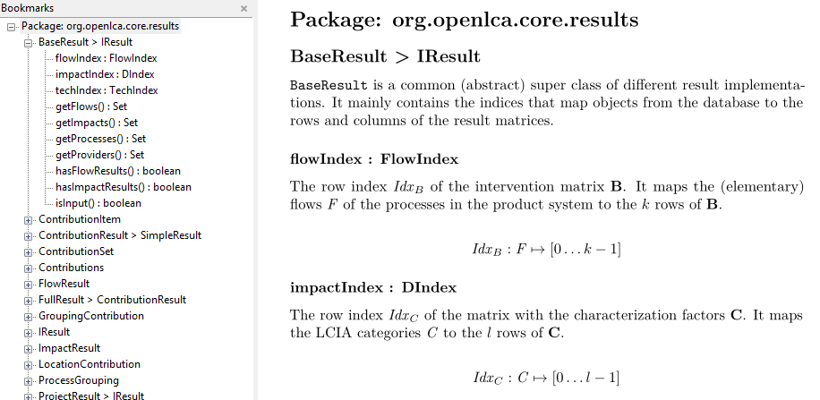

# jmd
`jmd` generates a single markdown file with the documentation of a Java project.
It extracts the JavaDoc comments and public symbols from the Java source files
using [JavaParser](https://github.com/javaparser/javaparser). The generated
output is particularly suitable for further processing with tools like
[Pandoc](https://pandoc.org/). With this, you can generate a document that looks
like this (using LaTeX equations etc.; here is the html version:
http://greendelta.github.io/olca-modules):



## Usage

```bash
java -jar jmd.jar --dir path/to/java/src > output.md
```

### Generating a standalone html file
There is a beautiful stylesheet available here: https://gist.github.com/killercup/5917178.

```bash
pandoc -s --katex --toc --css pandoc.css -o index.html apidoc.md
``` 

... then push this to the gh-pages branch of your repo...